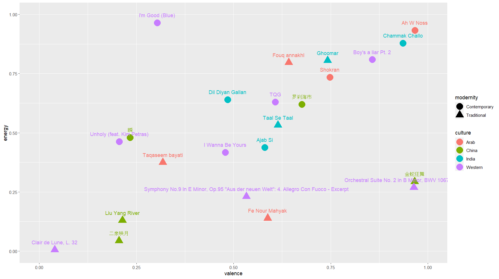

```{r setup, include=FALSE}
library(flexdashboard)
library(htmlwidgets)
library(tidyverse)
library(spotifyr)
library(plotly)

survey_songs <-
  get_playlist_audio_features("", "70RrIIkKSiARJwyQXUv30k?si=32f52496041844c4")

survey_songs$culture = c(rep("India", 5), rep("China", 5), rep("Arab", 5), rep("Western", 8))
survey_songs$modernity = c(rep("Traditional", 2), rep("Contemporary", 3), rep("Traditional", 3), rep("Contemporary", 2), rep("Traditional", 3), rep("Contemporary", 2), rep("Traditional", 3), rep("Contemporary", 5))

source("analysis.R")
source("plots.R")

```

Results
=======

Column {.sidebar data-width=300}
-----------------------------------------------------------------------
### Overview
This portfolio provides insights into our research on the accuracy and possible bias of the Spotify API song ratings when comparing Western and Non-Western music. The Non-Western variable was further separated into music from China, India, and the Middle East. Participants were asked to rate five songs of each Non-Western culture, of which two were considered contemporary and three from a more traditional background, based on two different categories that the Spotify API provides: valence and energy. To capture ratings of Western music, eight songs from Western-based artists were selected to represent the comparison group, again using four classical and four contemporary songs. We analyzed whether there were any differences in human- and Spotify-made ratings of these songs, considering different variables: the human rater’s ethnic background, whether the rated song is traditional or contemporary, and obviously whether the song comes form a Non-Western or Western background. On this page you’ll be able to get an overview of the results of our research.

Column
-----------------------------------------------------------------------
### Mood Data Differences {data-height=650}

```{r}
main_graph
```

<!-- ### Western vs. Non-Western -->

<!-- ### Four Regions -->

### Test results


Column
-----------------------------------------------------------------------
### Regional Response Differences {data-height=550}
```{r}
leaflet_widget
```


### Explanation of the plots


Background
==========

Column {.tabset}
-----------------------------------------------------------------------

### Background Information

### Bibliography
Lee, H., Hoeger, F., Schoenwiesner, M., Park, M., & Jacoby, N. (2021). [Cross-cultural mood perception in pop songs and its alignment with mood detection algorithms](https://doi.org/10.48550/arXiv.2108.00768) arXiv preprint arXiv:2108.00768.

Vidas, D., McGovern, H. T., & Nitschinsk, L. (2021). [Culture and ideal affect: Cultural dimensions predict Spotify listening patterns](http://dx.doi.org/10.31234/osf.io/95w2t)

Satayarak, N., & Benjangkaprasert, C. (2022, June). [On the Study of Thai Music Emotion Recognition Based on Western Music Model](http://dx.doi.org/10.1088/1742-6596/2261/1/012018) In Journal of Physics: Conference Series (Vol. 2261, No. 1, p. 012018). IOP Publishing.

Panda, R., Redinho, H., Gonçalves, C., Malheiro, R., & Paiva, R. P. (2021, July). [How does the spotify api compare to the music emotion recognition state-of-the-art?](https://zenodo.org/doi/10.5281/zenodo.5045099) In 18th Sound and Music Computing Conference (SMC 2021) (pp. 238-245). Axea sas/SMC Network.

Sangnark, S., Lertwatechakul, M., & Benjangkaprasert, C. (2018, October). [Thai music emotion recognition by linear regression](https://doi.org/10.1145/3293688.3293696) In Proceedings of the 2018 2nd International Conference on Automation, Control and Robots (pp. 62-66).


### Discussion


Column 
-----------------------------------------------------------------------

### Spotify Mood Data


```{r}
smd <- survey_songs |> 
  ggplot(aes(x = valence, y = energy, color = culture, shape = modernity, label = track.name)) + 
  xlim(0,1) + ylim(0,1) +
  geom_point(size=3)
ggplotly(smd)
```

<!--  -->

### Human Mood Data
```{r}
p <- survey_songs |> 
  ggplot(aes(x = valence, y = energy, color = culture, shape = modernity, label = track.name)) + 
  xlim(0,1) + ylim(0,1) +
  geom_point(size=3) +
  geom_text(hjust=.5, vjust=-2.2)

ggplotly(p)
```


Song Data
=========
Column {data-width=300}
-----------------------------------------------------------------------
<iframe style="border-radius:12px; padding-right:8px; padding-bottom:8px" src="https://open.spotify.com/embed/playlist/70RrIIkKSiARJwyQXUv30k?utm_source=generator&theme=0" width="100%" height="100%" frameBorder="0" allowfullscreen="" allow="autoplay; clipboard-write; encrypted-media; fullscreen; picture-in-picture" loading="lazy" data-external="1"></iframe>


Column {data-width=600}
-----------------------------------------------------------------------
### Clips used in the survey
Table with the clips, song title, artist, culture, modernity, (spotify/human ratings?
)
